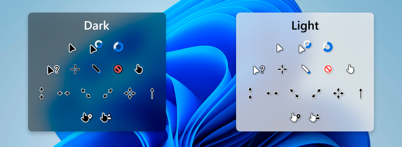

# dotfiles 
дотсы для win 11 
автоматическая установка через скрипты.

## Cursors preview

## Cursors installation
1. clone repo
2. pick Light or Dark variant
3. go to `<repo>/cursors/<dark or light folder>/`
4. find `install.inf`, right click on `install.inf`, and find `install`
5. profit
